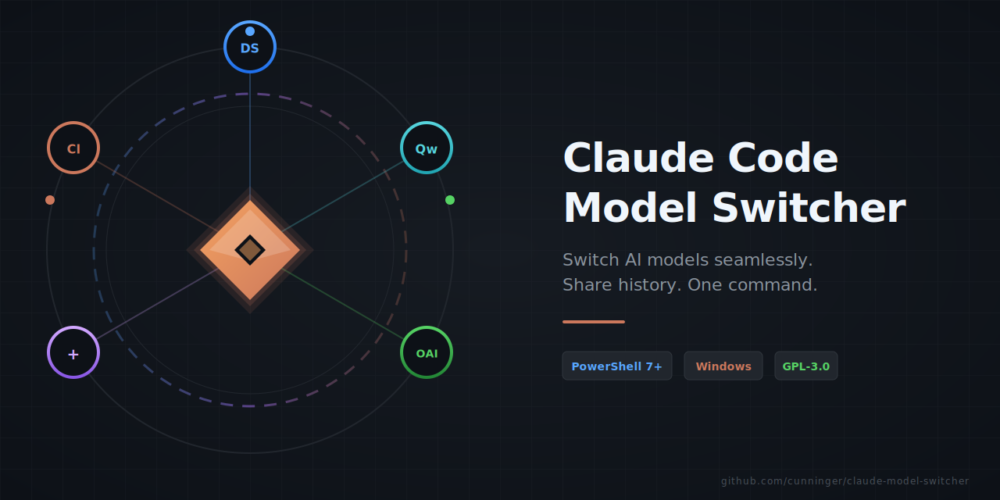
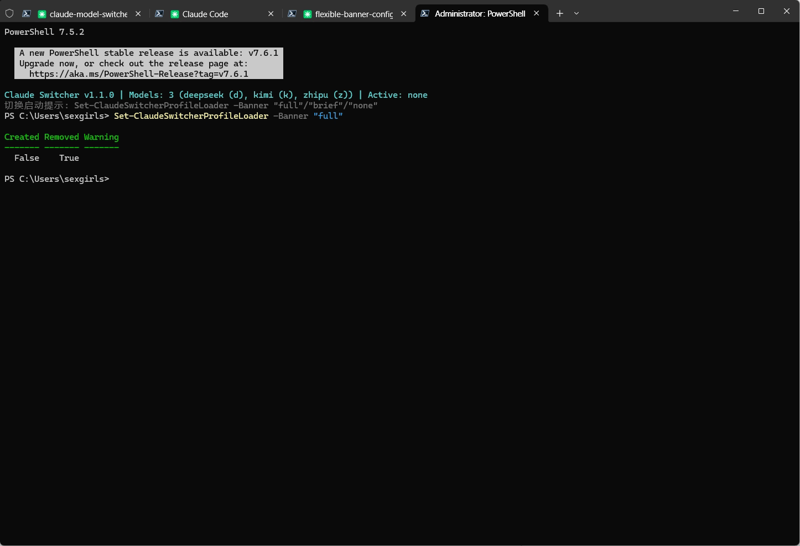

<div align="center">



<p>
  <strong>PowerShell 脚本</strong> · 让 Claude Code CLI 在 OpenAI / DeepSeek / Qwen 等多模型间一键切换，同时共享对话历史与自定义命令
</p>

<p>
  <a href="https://github.com/cunninger/claude-model-switcher/stargazers"></a>
  <a href="https://github.com/cunninger/claude-model-switcher/blob/master/LICENSE"></a>
  <a href="https://github.com/PowerShell/PowerShell"></a>
  <a href="https://docs.anthropic.com/en/docs/claude-code"></a>
  <a href="https://github.com/cunninger/claude-model-switcher/issues"></a>
</p>

<p>
  <a href="#快速开始">快速开始</a> •
  <a href="#功能特性">功能特性</a> •
  <a href="#架构原理">架构原理</a> •
  <a href="#命令列表">命令列表</a> •
  <a href="#english">English</a>
</p>



</div>

---

## 目录

- [快速开始](#快速开始)
- [功能特性](#功能特性)
- [前置依赖](#前置依赖)
- [安装](#安装)
- [使用指南](#使用指南)
- [自定义启动提示](#自定义启动提示)
- [架构原理](#架构原理)
- [命令列表](#命令列表)
- [配置说明](#配置说明)
- [常见问题](#常见问题)
- [配套文档](#配套文档)
- [贡献指南](#贡献指南)
- [许可证](#许可证)

---

## 快速开始

**推荐：一键自动安装**（复制以下两行命令到 PowerShell 7+ 终端执行）

```powershell
iwr https://raw.githubusercontent.com/cunninger/claude-model-switcher/master/install.ps1 -OutFile install.ps1
pwsh -File .\install.ps1
```

安装完成后，运行 `Add-ClaudeModel` 添加你的第一个 AI 模型：

```powershell
Add-ClaudeModel
# 然后输入模型标识，例如 deepseek，别名 d
deepseek    # 启动对应模型
d           # 或快捷别名
```

<details>
<summary>💡 手动安装（开发者/自定义路径）</summary>

```powershell
# 1. 克隆仓库
git clone https://github.com/cunninger/claude-model-switcher.git
cd claude-model-switcher

# 2. 加载脚本（dot-source）
. ./claude-model-switcher.ps1

# 3. 持久化：将以下行添加到 $PROFILE
. "D:\你的路径\claude-model-switcher.ps1"
```

</details>

---

## 功能特性

| 特性 | 说明 |
|------|------|
| ⚡ **一键切换** | 输入模型名或别名即可启动对应模型的 Claude Code |
| 🔄 **对话历史共享** | 所有模型的对话存储在统一目录，跨模型可无缝 `resume` |
| ⚙️ **配置自动合并** | 基础配置 + 模型特定配置自动合并，无需维护多份 `settings.json` |
| 🧙 **交互式添加模型** | `Add-ClaudeModel` 向导引导完成全部配置 |
| 🛡️ **跨模型 Resume 安全** | 可选修复未完成的 tool call，避免切换模型后 400 错误 |
| 🔔 **Windows Toast 通知** | 任务完成时弹出通知 + 音效提醒 |
| 📝 **动态注册** | 添加/删除模型后立即生效，无需重新加载脚本 |
| 🎚️ **三级启动提示** | `brief`（一行）/ `full`（完整）/ `none`（静默），一行命令随时切换 |

---

## 前置依赖

| 依赖 | 版本 | 必要性 | 安装方式 |
|------|------|--------|----------|
| [PowerShell](https://github.com/PowerShell/PowerShell) | 7+ | 必须 | `winget install Microsoft.PowerShell` |
| [Claude Code CLI](https://docs.anthropic.com/en/docs/claude-code) | 最新 | 必须 | `npm install -g @anthropic-ai/claude-code` |
| [BurntToast](https://github.com/Windos/BurntToast) | 最新 | 可选（通知功能） | `Install-Module -Name BurntToast -Scope CurrentUser` |

> **平台限制**：仅支持 Windows。脚本使用 Junction/SymbolicLink、Toast 通知等 Windows 特性。

---

## 安装

### 方式一：直接克隆（推荐）

```powershell
git clone https://github.com/cunninger/claude-model-switcher.git
cd claude-model-switcher
. ./claude-model-switcher.ps1
```

### 方式二：作为 PowerShell 模块

<!-- TODO: 未来可发布到 PSGallery，届时添加 Install-Module 方式 -->

---

## 使用指南

### 添加模型

```powershell
Add-ClaudeModel
```

跟随交互式向导输入：
1. 模型标识（如 `deepseek`、`qwen`、`gpt4o`）
2. 快捷别名（如 `d`、`q`、`g`）
3. API Base URL
4. API Key
5. 模型名称

### 切换模型

```powershell
# 使用模型标识
deepseek

# 使用别名
d

# 这些命令由脚本动态注册，每次添加新模型后立即可用
```

### 删除模型

```powershell
Remove-ClaudeModel
```

### 修复通知脚本

当脚本更新后，批量修复所有已配置模型的通知脚本：

```powershell
Repair-ClaudeNotify
```

### 自定义启动提示

脚本支持三级启动提示，打开新终端时显示不同信息量：

| 模式 | 说明 |
|------|------|
| `full` | 完整横幅 + 模型列表 + 状态信息（默认） |
| `brief` | 仅一行状态摘要 |
| `none` | 完全静默，无任何输出 |

**切换方式**（在 PowerShell 中执行，新开终端生效）：

```powershell
# 切换到完整提示
Set-ClaudeSwitcherProfileLoader -Banner "full"

# 切换到一行摘要
Set-ClaudeSwitcherProfileLoader -Banner "brief"

# 关闭启动提示
Set-ClaudeSwitcherProfileLoader -Banner "none"
```

> `brief` 模式的启动提示中会附带切换命令，方便随时复制调整。

---

## 架构原理


**核心设计**：

- **私有目录** (`~/.claude-<model>/`)：每个模型独立的配置、环境变量、通知脚本
- **共享目录** (`~/.claude-shared/`)：通过 Junction 链接统一存储对话历史、项目、自定义命令和 Skills
- **配置合并**：启动时自动将 `model-specific.json` 合并到 `settings.json`，无需手动同步

---

## 命令列表

| 命令 | 说明 | 使用频率 |
|------|------|----------|
| `Add-ClaudeModel` | 交互式添加新模型 | ⭐ 常用 |
| `Remove-ClaudeModel` | 交互式删除模型 | 偶尔 |
| `Repair-ClaudeNotify` | 批量修复/更新所有模型的通知脚本 | 升级后 |
| `Set-ClaudeModelSound` | 修改指定模型的通知音效 | 可选 |
| `Test-ModelNotify` | 试听通知效果 | 调试 |
| `Repair-ClaudeConversation` | 修复对话中未完成的 tool call | 排错 |
| `Test-ClaudeSwitcher` | 运行全面诊断，检查环境与配置 | 排错 |
| `Repair-ClaudeSwitcher` | 自动修复 Profile、共享目录、链接和通知脚本 | 排错 |
| `Test-ClaudeConversation` | 检查当前项目最近会话的 JSONL 健康状态 | 排错 |
| `Update-ClaudeModelSwitcher` | 一键更新到最新版本 | 升级后 |
| `Get-ClaudeSwitcherStatus` | 查看当前状态（模型数/活跃模型） | 日常 |

---

## 配置说明

### 目录结构

```
~/.claude-shared/                    # 共享数据根目录
├── conversations/                   # 所有模型的共享对话（Junction 链接）
├── projects/                        # 所有模型的共享项目（Junction 链接）
└── models-registry.json             # 模型注册表

~/.claude-<model>/                   # 每个模型的私有目录
├── settings.json                    # 自动生成，勿手动编辑
├── model-specific.json              # 模型特定配置（API 地址、Key、Hooks）
├── notify.ps1                       # 通知脚本（自动生成）
├── conversations/ → ~/.claude-shared/conversations/  # Junction
├── projects/       → ~/.claude-shared/projects/       # Junction
├── commands/       → ~/.claude/commands/               # Junction
└── skills/         → ~/.claude/skills/                 # Junction
```

### model-specific.json 示例

```json
{
  "env": {
    "ANTHROPIC_BASE_URL": "https://api.deepseek.com",
    "ANTHROPIC_AUTH_TOKEN": "sk-xxx",
    "ANTHROPIC_MODEL": "deepseek-chat"
  },
  "hooks": {}
}
```

---

## 常见问题

<details>
<summary><b>Q: 切换模型后 resume 出现 400 错误？</b></summary>

先运行只读健康检查，确认最近会话是否存在未闭合 tool call：

```powershell
Test-ClaudeConversation
```

脚本已内置 `Repair-ClaudeConversation` 修复未完成的 tool call。若需要切换模型时自动执行，可设置 `CLAUDE_SWITCHER_AUTO_REPAIR=1`；也可以手动运行：

```powershell
Repair-ClaudeConversation
```

</details>

<details>
<summary><b>Q: 诊断发现 Profile、Junction 或通知脚本异常？</b></summary>

先运行诊断：

```powershell
Test-ClaudeSwitcher
```

然后让脚本自动补齐常见环境问题：

```powershell
Repair-ClaudeSwitcher
```

</details>

<details>
<summary><b>Q: 通知功能不工作？</b></summary>

确保已安装 BurntToast：

```powershell
Install-Module -Name BurntToast -Scope CurrentUser -Force
```

然后运行 `Repair-ClaudeNotify` 重新生成通知脚本。

</details>

<details>
<summary><b>Q: 可以支持 macOS/Linux 吗？</b></summary>

目前依赖 Windows 特有的 Junction 链接和 Toast 通知 API。跨平台支持在 Roadmap 中，欢迎 PR。

</details>

---

## 配套文档

| 文档 | 说明 |
|------|------|
| [通知配置指南](claude-code-notification-guide.md) | Toast 通知和自定义音效的详细配置 |

---

## 贡献指南

欢迎 Issue 和 PR！

1. Fork 本仓库
2. 创建特性分支 (`git checkout -b feature/amazing-feature`)
3. 提交更改 (`git commit -m 'feat: add amazing feature'`)
4. 推送到分支 (`git push origin feature/amazing-feature`)
5. 创建 Pull Request

请确保：
- PowerShell 脚本遵循 [PoshCode 风格指南](https://github.com/PoshCode/PowerShellPracticeAndStyle)
- 提交信息遵循 [Conventional Commits](https://www.conventionalcommits.org/)

---

## Star 趋势

<!-- 建议安装 https://github.com/star-history/star-history 后替换为真实图表 -->
<!-- [](https://star-history.com/#cunninger/claude-model-switcher&Date) -->

如果这个项目对你有帮助，请考虑给个 ⭐ Star！

---

## 许可证

[GPL-3.0](LICENSE) © [cunninger](https://github.com/cunninger)

---

<div align="center">

<p><a href="#english">English Version Below ↓</a></p>

</div>

---

<a id="english"></a>

<div align="center">


<p>
  <strong>PowerShell script</strong> that enables Claude Code CLI to switch between multiple AI models (OpenAI, DeepSeek, Qwen, etc.) with a single command, while sharing conversation history and custom commands across all models.
</p>

<p>
  <a href="https://github.com/cunninger/claude-model-switcher/stargazers"></a>
  <a href="https://github.com/cunninger/claude-model-switcher/blob/master/LICENSE"></a>
  <a href="https://github.com/PowerShell/PowerShell"></a>
  <a href="https://docs.anthropic.com/en/docs/claude-code"></a>
  <a href="https://github.com/cunninger/claude-model-switcher/issues"></a>
</p>

<p>
  <a href="#quick-start">Quick Start</a> •
  <a href="#features">Features</a> •
  <a href="#architecture">Architecture</a> •
  <a href="#commands">Commands</a> •
  <a href="#中文">中文</a>
</p>


</div>

---

## Quick Start

**Recommended: One-line install** (copy and run in PowerShell 7+)

```powershell
iwr https://raw.githubusercontent.com/cunninger/claude-model-switcher/master/install.ps1 -OutFile install.ps1
pwsh -File .\install.ps1
```

After installation, run `Add-ClaudeModel` to configure your first AI model:

```powershell
Add-ClaudeModel
# Then type your model identifier, e.g. deepseek, alias d
deepseek    # Launch the model
d           # Or use the alias
```

<details>
<summary>💡 Manual Installation (Developers / Custom Path)</summary>

```powershell
# 1. Clone
git clone https://github.com/cunninger/claude-model-switcher.git
cd claude-model-switcher

# 2. Load the script (dot-source)
. ./claude-model-switcher.ps1

# 3. Persist: add to $PROFILE
. "C:\path\to\claude-model-switcher.ps1"
```

</details>

---

## Features

| Feature | Description |
|---------|-------------|
| ⚡ **One-command switching** | Launch Claude Code with a specific model by typing its name or alias |
| 🔄 **Shared conversation history** | All models share a single conversation store; resume works across models |
| ⚙️ **Auto-merged config** | Base settings + model-specific settings are merged automatically |
| 🧙 **Interactive model wizard** | `Add-ClaudeModel` walks you through the full setup |
| 🛡️ **Safe cross-model resume** | Optionally repairs incomplete tool calls to prevent API 400 errors |
| 🔔 **Windows Toast notifications** | Desktop notification + sound when Claude finishes |
| 📝 **Dynamic registration** | Added/removed models take effect immediately |
| 🎚️ **Three-level startup banner** | `brief` (one-line) / `full` (complete) / `none` (silent) — switch with a single command |

---

## Prerequisites

| Dependency | Version | Required | Installation |
|------------|---------|----------|--------------|
| [PowerShell](https://github.com/PowerShell/PowerShell) | 7+ | Yes | `winget install Microsoft.PowerShell` |
| [Claude Code CLI](https://docs.anthropic.com/en/docs/claude-code) | Latest | Yes | `npm install -g @anthropic-ai/claude-code` |
| [BurntToast](https://github.com/Windos/BurntToast) | Latest | Optional (notifications) | `Install-Module -Name BurntToast -Scope CurrentUser` |

> **Platform**: Windows only — uses Junctions, SymbolicLinks, Toast notifications, and other Windows-specific features.

---

## Installation

### Option 1: Clone (Recommended)

```powershell
git clone https://github.com/cunninger/claude-model-switcher.git
cd claude-model-switcher
. ./claude-model-switcher.ps1
```

### Option 2: PowerShell Module (Future)

<!-- TODO: Publish to PSGallery -->

---

## Usage

### Add a Model

```powershell
Add-ClaudeModel
```

Follow the interactive wizard to enter:
1. Model identifier (e.g. `deepseek`, `qwen`, `gpt4o`)
2. Shortcut alias (e.g. `d`, `q`, `g`)
3. API Base URL
4. API Key
5. Model name

### Switch Models

```powershell
# Use model identifier
deepseek

# Use alias
d

# Commands are dynamically registered and available immediately
```

### Remove a Model

```powershell
Remove-ClaudeModel
```

### Repair Notification Scripts

After updating the script, batch-repair notification scripts for all configured models:

```powershell
Repair-ClaudeNotify
```

### Customize Startup Banner

The script supports three banner levels that control what information is displayed when you open a new terminal:

| Mode | Description |
|------|-------------|
| `full` | Full banner + model list + status info (default) |
| `brief` | Single-line status summary |
| `none` | Completely silent, no output |

**Switching** (run in PowerShell, takes effect in new terminals):

```powershell
# Full banner
Set-ClaudeSwitcherProfileLoader -Banner "full"

# One-line summary
Set-ClaudeSwitcherProfileLoader -Banner "brief"

# Silent mode
Set-ClaudeSwitcherProfileLoader -Banner "none"
```

> In `brief` mode, the startup line includes the switching command so you can copy it at any time.

---

## Architecture


**Design Principles**:

- **Private directories** (`~/.claude-<model>/`): Per-model configs, env vars, notification scripts
- **Shared directory** (`~/.claude-shared/`): Unified conversation history, projects, custom commands, and skills via Junction links
- **Config merging**: Automatically merges `model-specific.json` into `settings.json` on launch

---

## Commands

| Command | Description | Frequency |
|---------|-------------|-----------|
| `Add-ClaudeModel` | Add a new model (interactive wizard) | ⭐ Daily |
| `Remove-ClaudeModel` | Remove a model (interactive, with confirmation) | Occasional |
| `Repair-ClaudeNotify` | Batch repair/update notification scripts for all models | After upgrade |
| `Set-ClaudeModelSound` | Change notification sound for a specific model | Optional |
| `Test-ModelNotify` | Preview notification effect | Debugging |
| `Repair-ClaudeConversation` | Fix incomplete tool calls in conversation history | Troubleshooting |
| `Test-ClaudeSwitcher` | Run full diagnostics on environment and config | Troubleshooting |
| `Repair-ClaudeSwitcher` | Repair profile loader, shared directories, links, and notification scripts | Troubleshooting |
| `Test-ClaudeConversation` | Check the latest JSONL conversation health for the current project | Troubleshooting |
| `Update-ClaudeModelSwitcher` | One-click update to the latest version | After upgrade |
| `Get-ClaudeSwitcherStatus` | Show current status (model count / active model) | Daily |

---

## Configuration

### Directory Structure

```
~/.claude-shared/                    # Shared data root
├── conversations/                   # Shared conversations (Junction)
├── projects/                        # Shared projects (Junction)
└── models-registry.json             # Model registry

~/.claude-<model>/                   # Per-model private directory
├── settings.json                    # Auto-generated, do not edit manually
├── model-specific.json              # Model-specific config (API URL, Key, Hooks)
├── notify.ps1                       # Notification script (auto-generated)
├── conversations/ → ~/.claude-shared/conversations/  # Junction
├── projects/       → ~/.claude-shared/projects/       # Junction
├── commands/       → ~/.claude/commands/               # Junction
└── skills/         → ~/.claude/skills/                 # Junction
```

### model-specific.json Example

```json
{
  "env": {
    "ANTHROPIC_BASE_URL": "https://api.deepseek.com",
    "ANTHROPIC_AUTH_TOKEN": "sk-xxx",
    "ANTHROPIC_MODEL": "deepseek-chat"
  },
  "hooks": {}
}
```

---

## FAQ

<details>
<summary><b>Q: 400 error when resuming after switching models?</b></summary>

Run the read-only health check first to see whether the latest conversation has unclosed tool calls:

```powershell
Test-ClaudeConversation
```

The script includes `Repair-ClaudeConversation` to fix incomplete tool calls. Set `CLAUDE_SWITCHER_AUTO_REPAIR=1` to run it automatically when switching models, or run it manually:

```powershell
Repair-ClaudeConversation
```

</details>

<details>
<summary><b>Q: Diagnostics report Profile, Junction, or notification issues?</b></summary>

Run diagnostics first:

```powershell
Test-ClaudeSwitcher
```

Then repair common environment issues automatically:

```powershell
Repair-ClaudeSwitcher
```

</details>

<details>
<summary><b>Q: Notifications not working?</b></summary>

Ensure BurntToast is installed:

```powershell
Install-Module -Name BurntToast -Scope CurrentUser -Force
```

Then run `Repair-ClaudeNotify` to regenerate notification scripts.

</details>

<details>
<summary><b>Q: macOS/Linux support?</b></summary>

Currently relies on Windows-specific Junction links and Toast notification APIs. Cross-platform support is on the roadmap — PRs welcome.

</details>

---

## Documentation

| Document | Description |
|----------|-------------|
| [Notification Guide](claude-code-notification-guide.md) | Detailed Toast notification and custom sound configuration |

---

## Contributing

Issues and PRs are welcome!

1. Fork the repository
2. Create a feature branch (`git checkout -b feature/amazing-feature`)
3. Commit changes (`git commit -m 'feat: add amazing feature'`)
4. Push to the branch (`git push origin feature/amazing-feature`)
5. Open a Pull Request

Guidelines:
- Follow the [PoshCode Style Guide](https://github.com/PoshCode/PowerShellPracticeAndStyle)
- Use [Conventional Commits](https://www.conventionalcommits.org/) for commit messages

---

## Star History

<!-- [](https://star-history.com/#cunninger/claude-model-switcher&Date) -->

If you find this project helpful, please consider giving it a ⭐!

---

## License

[GPL-3.0](LICENSE) © [cunninger](https://github.com/cunninger)
